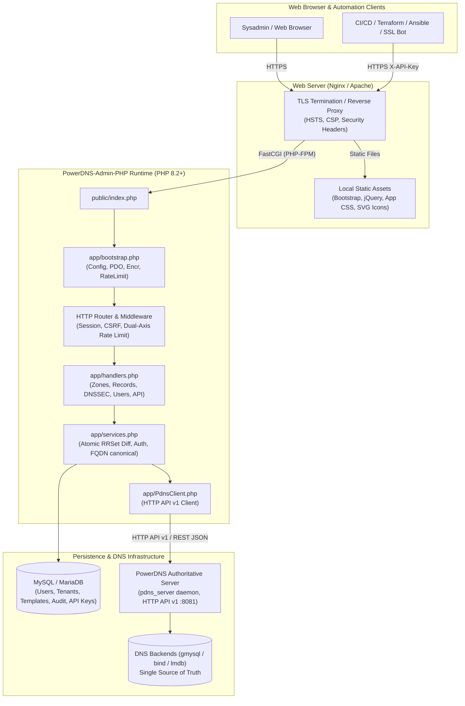

# PowerDNS-Admin-PHP — Enterprise Authoritative PowerDNS Control Plane

<p align="center">
  <a href="https://github.com/alsyundawy/PowerDNS-Admin-PHP">
    
  </a>
</p>

[](https://github.com/alsyundawy/PowerDNS-Admin-PHP/releases)
[](https://www.php.net/)
[](https://www.powerdns.com/)
[](LICENSE)
[](https://github.com/alsyundawy/PowerDNS-Admin-PHP)
[](https://getbootstrap.com/)
[](https://mariadb.org/)
[](https://www.paypal.me/alsyundawy)

> **Enterprise-grade, security-hardened Web GUI and automation engine for PowerDNS Authoritative Server.
> Engineered with pure native PHP & PDO, sub-millisecond bootstrap, zero external CDN dependencies, dual dark/light theming
> inspired by Visual Subnet Calculator, MariaDB/MySQL metadata persistence, and direct PowerDNS HTTP API v1 integration.**
>
> Designed, engineered, and maintained by
> **[`HARRY DERTIN SUTISNA ALSYUNDAWY (@alsyundawy)`](https://github.com/alsyundawy)** —
> Built for mission-critical DNS operations.
>
> 📦 **[`GitHub Releases`](https://github.com/alsyundawy/PowerDNS-Admin-PHP/releases)** &nbsp;|&nbsp;
> 📖 **[`Installation Guide`](#-installation--setup-guide)** &nbsp;|&nbsp;
> 🛠️ **[`Architecture & Request Pipeline`](#️-architecture--request-pipeline)** &nbsp;|&nbsp;
> 🏛️ **[`Architecture & Notes`](DOCNOTE.md)** &nbsp;|&nbsp;
> 📜 **[`Full Changelog`](CHANGELOG.md)** &nbsp;|&nbsp;
> 💖 **[`Support via PayPal`](https://www.paypal.me/alsyundawy)** &nbsp;|&nbsp;
> 🇮🇩 **[`QRIS Donation`](#-support--donation)**

---

## 🧭 Navigation

- [Overview](#-overview)
- [Why This Modernized Edition?](#-why-this-modernized-edition)
- [Key Features](#-key-features)
- [Architecture & Request Pipeline](#️-architecture--request-pipeline)
- [DNS Record Types & Authoritative Engine](#-dns-record-types--authoritative-engine)
- [Visual Subnet Calculator Design & Mobile Responsive System](#-visual-subnet-calculator-design--mobile-responsive-system)
- [Cross-OS Production Deployment & Migration](#-cross-os-production-deployment--migration)
- [Installation & Setup Guide](#-installation--setup-guide)
- [Usage & Quick Start](#usage--quick-start)
- [Configuration Reference](#️-configuration-reference)
- [REST API & Automation Layer](#-rest-api--automation-layer)
- [Quality Assurance & Verification Gates](#-quality-assurance--verification-gates)
- [Engineering Standards & Invariants](#-engineering-standards--invariants)
- [Security & Content Safety](#-security--content-safety)
- [Project Directory Structure](#-project-directory-structure)
- [Contributing](#-contributing)
- [Maintainer & Contact](#-maintainer--contact)
- [Support & Donation](#-support--donation)
- [License](#-license)

---

## 🌟 Overview

**PowerDNS-Admin-PHP** is a high-performance, web-based authoritative DNS management control plane engineered
specifically for system administrators, hosting providers, ISP network engineers, and DevOps teams.

Managing PowerDNS zones via direct SQL queries or heavyweight control panels burdened with complex Python/Flask
virtual environments, NPM build steps, or external daemon microservices introduces significant operational overhead,
high memory consumption, and security attack vectors. **PowerDNS-Admin-PHP** solves this by providing a clean,
lightweight, native PHP PDO web application communicating directly with PowerDNS Authoritative via its official
HTTP API v1.

Operating on Debian, Ubuntu, Rocky Linux, AlmaLinux, or CentOS, PowerDNS-Admin-PHP delivers sub-millisecond local
page rendering, atomic RRSet diff-patch updates, multi-tenant role-based access control (RBAC), end-to-end DNSSEC
management, and complete operational autonomy with zero runtime external CDN dependencies.

---

## 🚀 Why This Modernized Edition?

This edition (**v0.2.1**) represents a clean-slate architectural, security, accessibility, and visual overhaul of
PowerDNS administration:

### 🛡️ 1. Zero-CDN Offline Architecture & Content Security

- **100% Local Distribution**: Ships with production bundles of **Bootstrap 5.3**, **jQuery 3.7**, and native SVG
  icons located in `public/assets/vendor/`.
- **Air-Gapped & Offline Ready**: Runs reliably in isolated server networks, air-gapped data centers, and private
  intranets without third-party CDN latency, outages, or telemetry tracking.
- **Strict Content Security Policy (CSP)**: HTTP headers enforce `default-src 'self'`, `script-src 'self'`,
  `style-src 'self' 'unsafe-inline'`, and `img-src 'self' data:` with zero third-party external origins permitted.

### ⚡ 2. Single Source of Truth (Pure Authoritative Integration)

- **Zero Database Duplication**: DNS resource records are **never duplicated** in the panel database. PowerDNS
  remains the authoritative source of truth.
- **Live State Sync**: The panel database persists only user accounts, tenant groups, zone templates, audit logs, and
  hashed API keys. Zone data and RRsets are queried and updated in real-time through the PowerDNS HTTP API v1.
- **Atomic RRSet Diff Engine**: When modifying a zone, the panel computes the exact mathematical diff between the
  existing RRsets and requested modifications, transmitting only the mutated sets to PowerDNS in a single atomic PATCH payload.

### 🎨 3. Visual Subnet Calculator Theming & Mobile Notch Optimization

- **Ergonomic Palette**: Inspired by the dark/light design system of
  [Visual Subnet Calculator](https://alsyundawy.github.io/visualsubnetcalc).
- **Dual Synchronization**: Instant theme reactivity syncing both `data-bs-theme` and local state across
  `dark` and `light` preferences with smooth transitions and high contrast.
- **Notch & Cutout Safe**: Implements `viewport-fit=cover`, CSS `env(safe-area-inset-*)`, and modern `100dvh`
  viewport units to prevent content clipping on mobile devices (including iPhone, Xiaomi, Redmi, Poco, and Android tablets).

### 🔒 4. Enterprise Security & Defense-in-Depth

- **AES-256-GCM Encrypted Credentials**: PowerDNS API keys and sensitive tokens are encrypted at rest using
  `aes-256-gcm` authenticated encryption with cryptographically random initialization vectors (IV).
- **Argon2id Password Hashes**: Passwords are saved with `password_hash($password, PASSWORD_ARGON2ID)` using secure
  memory and time cost factors.
- **Dual-Axis Rate Limiting**: Independent IP and username rate limiters on authentication endpoints safeguard against
  distributed brute-force attacks.
- **Cryptographic CSRF Protection**: Session-bound cryptographic tokens validate every mutating `POST` request with
  automatic token rotation.

### 🗄️ 5. Zero-Framework Sub-Millisecond Native Architecture

- **Ultra-Low Memory Footprint**: Uses $< 2\text{ MB}$ RAM per HTTP request without the multi-megabyte overhead of
  heavyweight frameworks.
- **Sub-Millisecond Bootstrap**: Boots in $< 1\text{ ms}$, ensuring lightning-fast dashboard navigation even on
  entry-level VPS instances ($512\text{ MB}$ RAM).
- **Prepared PDO Statements**: Every query utilizes parameterized PDO statements, completely eliminating SQL injection risks.

---

## 🎯 Key Features

| Capability Area                | Highlights & Implementations                                                                                                                                  |
| :----------------------------- | :------------------------------------------------------------------------------------------------------------------------------------------------------------ |
| **Zone Management**            | Forward and reverse zones, supporting `Native`, `Master`, `Slave`, `Producer`, and `Consumer` kinds with configurable `SOA-EDIT-API` metadata.                |
| **Smart RRSet Editor**         | Interactive visual editor with RFC syntax validation for `A`, `AAAA`, `CNAME`, `MX`, `TXT`, `NS`, `PTR`, `SRV`, `CAA`, `HTTPS`, `SVCB`, `DS`, etc.            |
| **Subnet rDNS Wizard**         | Interactive IPv4 `/24` and IPv6 `/64` (RFC 3596 nibble format) subnet calculator, batch PTR generator, and automatic forward-to-reverse PTR sync.             |
| **Zone History & Rollback**    | Automatic revision snapshots on every modification, visual record diff inspection, and 1-click atomic rollback to any past zone state.                        |
| **Native BIND RFC 1035**       | Native RFC 1035 zone file parser (`$ORIGIN`, `$TTL`, multiline parenthesized SOA) supporting file upload / paste and 1-click `.zone` BIND export.             |
| **Modern DNSSEC Suite**        | Cutting-edge **Ed25519 (Alg 15)** and **ECDSA (Alg 13/14)** signing with automated parent delegation bootstrapping (**RFC 7344 CDS / CDNSKEY**).              |
| **Dynamic DNS (DynDNS 2)**     | Standard `/nic/update` HTTP endpoint compatible with routers, ddclient, Mikrotik, and IoT devices using Basic Auth or API Key tokens.                         |
| **Zone Templates**             | Standardized templates (web hosting, mail clusters, CDN endpoints) with `[ZONE]` macro expansion for rapid multi-zone rollout.                                |
| **DNS Operations Engine**      | Instant manual `NOTIFY` propagation to secondary nameservers and on-demand `AXFR Retrieve` zone synchronization directly from the UI.                         |
| **Multi-Tenancy & RBAC**       | Fine-grained role hierarchy (`admin`, `operator`, `user`). Users can be assigned to multi-user Accounts or granted direct per-zone `Read`/`Edit` permissions. |
| **Global Instant Search**      | Sub-second fuzzy search across zone names, record comments, and RRSet contents powered by the PowerDNS `/search-data` API endpoint.                           |
| **Tamper-Evident Audit Trail** | Comprehensive logging of authentication events, zone creation, record mutations, and role elevations with IP addresses and user agents.                       |
| **Live Telemetry Dashboard**   | Real-time server telemetry: UDP/TCP query volume, packetcache hit/miss ratio, recursion statistics, and operational load metrics.                             |
| **Database & Zone Backup**     | 1-Click MySQL metadata SQL dump/restore with query sanitation, settings JSON export, and full PowerDNS zones API snapshot suite.                              |
| **User Profile & Avatar**      | Self-service profile management, Argon2id password changes, secure image avatar upload, and universal UI avatar integration.                                  |
| **Custom Branding & GUI**      | Customizable panel branding (Logo upload/URL, custom App Name, custom footer text) and integrated dashboard quick controls.                                   |
| **Advanced Network Tools**     | IPCalc (IPv4/IPv6 bitwise), memory-safe IPv6 Subnet Splitter (up to 65k subnets), WHOIS/RDAP client (RFC 9082), and native DNS lookup resolver.               |
| **Panel REST API**             | External token-authenticated REST API (`X-API-Key`) for automation via Ansible, Terraform, ACME Let's Encrypt bots, and custom scripts.                       |

---

## 🏗️ Architecture & Request Pipeline

PowerDNS-Admin-PHP follows a clean, decoupled MVC-inspired architecture with strict separation between presentation,
domain services, and storage:



---

## 📊 DNS Record Types & Authoritative Engine

PowerDNS-Admin-PHP validates and formats all standard authoritative DNS Resource Record Sets:

| Record Type | Description                           | RFC Standard       | Syntax Validation & Format Specs                                |
| :---------- | :------------------------------------ | :----------------- | :-------------------------------------------------------------- |
| **`A`**     | IPv4 Host Address                     | RFC 1035           | Dotted-decimal format: `0.0.0.0` – `255.255.255.255`            |
| **`AAAA`**  | IPv6 Host Address                     | RFC 3596           | Standard compressed or uncompressed RFC 4291 IPv6               |
| **`CNAME`** | Canonical Name (Alias)                | RFC 1035           | Fully Qualified Domain Name (FQDN) ending with a trailing dot   |
| **`MX`**    | Mail Exchange Server                  | RFC 1035, RFC 7505 | Priority integer (`0–65535`) followed by mail exchanger FQDN    |
| **`NS`**    | Authoritative Name Server             | RFC 1035           | Authoritative nameserver FQDN ending with a trailing dot        |
| **`TXT`**   | Text Annotations (SPF, DKIM, DMARC)   | RFC 1464, RFC 7208 | Character string enclosed in quotes, automatic multiline escape |
| **`PTR`**   | Pointer Record (Reverse DNS)          | RFC 1035           | Target host FQDN ending with a trailing dot                     |
| **`SRV`**   | Service Location Record               | RFC 2782           | Priority, weight, port (`1–65535`), and target hostname         |
| **`CAA`**   | Certification Authority Authorization | RFC 6844, RFC 8659 | Flag byte, tag (`issue`, `issuewild`, `iodef`), CA domain       |
| **`SSHFP`** | SSH Public Key Fingerprint            | RFC 4255, RFC 6594 | Algorithm, fingerprint type (`1` SHA-1, `2` SHA-256), hex data  |
| **`TLSA`**  | DANE Transport Layer Security Auth    | RFC 6698, RFC 7671 | Certificate usage, selector, matching type, cert hex data       |
| **`NAPTR`** | Naming Authority Pointer              | RFC 3403           | Order, preference, flags, service, regex, replacement FQDN      |
| **`SPF`**   | Sender Policy Framework (Legacy)      | RFC 4408           | Text string policy definition                                   |
| **`SOA`**   | Start of Authority                    | RFC 1035, RFC 2181 | Primary NS, contact email, serial, refresh, retry, expire, TTL  |

---

## 🎨 Visual Subnet Calculator Design & Mobile Responsive System

The interface has been meticulously designed following the acclaimed aesthetic of
[Visual Subnet Calculator](https://alsyundawy.github.io/visualsubnetcalc):

- **Curated Dark/Light Palette**: Deep obsidian dark background (`#0b0f19` / `#111827`), slate borders
  (`#1f2937` / `#334155`), and vibrant primary blue accents (`#3b82f6` with `#60a5fa` hover glow).
- **Glassmorphism Navigation Header**: Semi-transparent sticky navigation bar with `backdrop-filter: blur(12px)`.
- **Notch, Cutout & Safe Area Insets**: Integrated with `viewport-fit=cover` and CSS safe-area padding
  (`padding-top: env(safe-area-inset-top, 0px); padding-bottom: env(safe-area-inset-bottom, 0px);`).
- **Dynamic Viewport Height**: Replaces rigid `100vh` with adaptive `100dvh` to eliminate unwanted layout shifts
  under mobile address bars.
- **Touch-Friendly Overflow Scrolling**: Horizontal table wrappers utilize `-webkit-overflow-scrolling: touch` with
  rounded boundary containers.

---

## 🌐 Cross-OS Production Deployment & Migration

PowerDNS-Admin-PHP is verified across enterprise Linux operating systems. When migrating between distributions,
the primary variation lies in package management and web server configurations:

### Distribution Paths & Configuration Mapping

| Component / Setting      | Ubuntu 22.04 / 24.04 & Debian 11 / 12 | Rocky Linux 8 / 9 & AlmaLinux 8 / 9    |
| :----------------------- | :------------------------------------ | :------------------------------------- |
| **Package Names**        | `pdns-server`, `pdns-backend-mysql`   | `pdns`, `pdns-backend-mysql`           |
| **Systemd Service**      | `pdns.service`                        | `pdns.service`                         |
| **Main Config File**     | `/etc/powerdns/pdns.conf`             | `/etc/pdns/pdns.conf`                  |
| **Web Server Root**      | `/var/www/PowerDNS-Admin-PHP/public`  | `/var/www/PowerDNS-Admin-PHP/public`   |
| **Application Config**   | `/etc/pda/config.php`                 | `/etc/pda/config.php`                  |
| **PHP-FPM Socket**       | `/run/php/php8.3-fpm-pda.sock`        | `/run/php-fpm/www.sock`                |
| **Service User / Group** | `www-data:www-data`                   | `nginx:nginx` or `apache:apache`       |
| **Firewall Management**  | `ufw` (Uncomplicated Firewall)        | `firewalld` or `nftables` / `iptables` |

### Hardened PowerDNS Authoritative Configuration (`pdns.conf`)

Add the following directives to your PowerDNS daemon configuration (e.g., `/etc/powerdns/pdns.conf`):

```ini
# Enable Built-in Web Server and REST API
api=yes
api-key=SandiRahasiaApiPowerDNS_456!
webserver=yes
webserver-address=127.0.0.1
webserver-port=8081
webserver-allow-from=127.0.0.1,::1

# Authoritative Operational Settings
master=yes
slave=yes
soa-edit-api=DEFAULT
```

### Production Firewall Configuration

#### Ubuntu / Debian (UFW)

```bash
# Allow standard SSH and Web traffic
sudo ufw allow 22/tcp
sudo ufw allow 80/tcp
sudo ufw allow 443/tcp

# Allow Authoritative DNS traffic
sudo ufw allow 53/tcp
sudo ufw allow 53/udp

# Enable firewall
sudo ufw enable
```

#### Rocky Linux / AlmaLinux / CentOS (Firewalld)

```bash
# Using firewalld
sudo firewall-cmd --permanent --add-service=http
sudo firewall-cmd --permanent --add-service=https
sudo firewall-cmd --permanent --add-service=dns
sudo firewall-cmd --reload
```

---

## 📦 Installation & Setup Guide

### 1. Prerequisites

Ensure your host environment satisfies the minimum requirements:

- **PHP**: 8.2, 8.3, 8.4, or 8.5 with `pdo_mysql`, `curl`, `mbstring`, `xml`, `intl`, `openssl`.
- **Database**: MariaDB 10.5+ or MySQL 8.0+ with `utf8mb4` encoding.
- **Web Server**: Nginx (recommended) with PHP-FPM.
- **DNS Daemon**: PowerDNS Authoritative Server 4.5+ with API module enabled.

### 2. Method 1: Automated Shell Installation (Debian / Ubuntu)

Repositori ini menyertakan skrip installer non-interaktif yang siap pakai:

```bash
# 1. Unduh repositori ke direktori web server
git clone https://github.com/alsyundawy/PowerDNS-Admin-PHP.git /var/www/PowerDNS-Admin-PHP
cd /var/www/PowerDNS-Admin-PHP

# 2. Jalankan skrip instalasi dengan hak akses root/sudo
sudo bash deploy/install-debian.sh
```

Skrip ini secara otomatis memasang seluruh paket dependensi, mengonfigurasi pool PHP-FPM dedicated, menyetel vhost Nginx,
dan mengatur perizinan direktori.

---

### 3. Method 2: Manual Step-by-Step Installation

#### Step A: Install System Packages

```bash
sudo apt update && sudo apt install -y \
  nginx mariadb-server \
  php-fpm php-mysql php-curl php-mbstring php-xml php-intl php-gmp php-bcmath php-zip \
  curl git unzip ca-certificates
```

#### Step B: Create Panel Database & User

Masuk ke console MariaDB/MySQL:

```bash
sudo mysql -u root
```

Jalankan perintah SQL pembuatan database (dengan hak akses ganda localhost dan 127.0.0.1):

```sql
CREATE DATABASE pda CHARACTER SET utf8mb4 COLLATE utf8mb4_unicode_ci;
CREATE USER 'pda_user'@'localhost' IDENTIFIED BY 'GantiDenganSandiKuat_123!';
CREATE USER 'pda_user'@'127.0.0.1' IDENTIFIED BY 'GantiDenganSandiKuat_123!';
GRANT ALL ON pda.* TO 'pda_user'@'localhost';
GRANT ALL ON pda.* TO 'pda_user'@'127.0.0.1';
FLUSH PRIVILEGES;
EXIT;
```

#### Step C: Clone Repository & Set Permissions

```bash
sudo git clone https://github.com/alsyundawy/PowerDNS-Admin-PHP.git /var/www/PowerDNS-Admin-PHP
sudo chown -R www-data:www-data /var/www/PowerDNS-Admin-PHP
sudo chmod -R 750 /var/www/PowerDNS-Admin-PHP
```

#### Step D: Configure Nginx Virtual Host

Salin konfigurasi vhost siap pakai dari [`deploy/nginx.conf`](deploy/nginx.conf):

```bash
sudo cp /var/www/PowerDNS-Admin-PHP/deploy/nginx.conf /etc/nginx/sites-available/powerdns-admin.conf
sudo ln -s /etc/nginx/sites-available/powerdns-admin.conf /etc/nginx/sites-enabled/
sudo nginx -t && sudo systemctl reload nginx
```

> [!IMPORTANT]
> Pastikan direktori `root` Nginx diarahkan ke subdirektori **`public/`** (`/var/www/PowerDNS-Admin-PHP/public`),
> bukan ke direktori root repositori, untuk melindungi berkas logika aplikasi dan konfigurasi dari akses HTTP langsung.

#### Step E: Run the Web Installer Wizard

1. Buka peramban dan akses: `http://ip-server-anda/install`
2. Masukkan informasi koneksi database MariaDB:
   - **Database Host:** `127.0.0.1`
   - **Database Port:** `3306`
   - **Database Name:** `pda`
   - **Database User:** `pda_user`
   - **Database Password:** `GantiDenganSandiKuat_123!`
3. Tentukan akun Administrator awal dan kredensial API PowerDNS:
   - **PowerDNS API URL:** `http://127.0.0.1:8081`
   - **PowerDNS API Key:** `SandiRahasiaApiPowerDNS_456!`
4. Klik **Pasang Sekarang**. Skrip akan otomatis menginisialisasi tabel database [`sql/schema.sql`](sql/schema.sql),
   membangkitkan encryption key di `/etc/pda/config.php`, dan mengarahkan Anda ke halaman login `/login`.

---

## Usage & Quick Start

### Development & Local Testing

Untuk menjalankan dan menguji aplikasi secara mandiri menggunakan server web internal PHP:

```bash
php -S 127.0.0.1:8000 -t public
```

Buka peramban web pada alamat `http://127.0.0.1:8000` untuk mengakses antarmuka panel administrasi.

### Production Service Management

Pada server produksi Linux (Debian, Ubuntu, RHEL, AlmaLinux), aplikasi berjalan di bawah Nginx dan PHP-FPM:

```bash
# Memeriksa status dan menjalankan ulang layanan
sudo systemctl restart php8.3-fpm
sudo systemctl restart nginx
sudo systemctl status pdns
```

---

## ⚙️ Configuration Reference

Konfigurasi aplikasi disimpan pada berkas terisolasi `/etc/pda/config.php` (dengan izin `640` milik `www-data`):

| Setting Key        | Tipe Data | Default / Contoh Nilai      | Keterangan                                                     |
| :----------------- | :-------- | :-------------------------- | :------------------------------------------------------------- |
| `db.host`          | `string`  | `"127.0.0.1"`               | Alamat host database MariaDB/MySQL panel.                      |
| `db.port`          | `int`     | `3306`                      | Port koneksi database.                                         |
| `db.name`          | `string`  | `"pda"`                     | Nama database panel.                                           |
| `db.user`          | `string`  | `"pda_user"`                | Username database panel.                                       |
| `db.pass`          | `string`  | `"[REDACTED]"`              | Kata sandi database.                                           |
| `app.secret_key`   | `string`  | `"[HEX 64 chars]"`          | Master secret key untuk enkripsi AES-256-GCM.                  |
| `pdns_api_url`     | `string`  | `"http://127.0.0.1:8081"`   | URL endpoint PowerDNS Authoritative HTTP API v1.               |
| `pdns_api_key`     | `string`  | `"[AES-256-GCM Encrypted]"` | Kunci API PowerDNS daemon (tersimpan terenkripsi di database). |
| `session_lifetime` | `int`     | `7200`                      | Batas waktu sesi aktif pengguna dalam detik (2 jam).           |
| `rate_limit_ip`    | `int`     | `10`                        | Batas percobaan login per IP per jendela waktu 15 menit.       |
| `rate_limit_user`  | `int`     | `5`                         | Batas percobaan login per username per jendela waktu 15 menit. |

---

## 🌐 REST API & Automation Layer

PowerDNS-Admin-PHP menyediakan antarmuka REST API yang aman untuk integrasi otomatisasi (Terraform, Ansible, skrip Python/Bash):

### Autentikasi

Semua request API memerlukan header `X-API-Key` dengan token yang dibangkitkan dari menu **API Keys**:

```http
X-API-Key: pda_live_9f83ac7b12d5e4a8b7c6d5e4f3a2b1c0
```

### Endpoint Utama

| Method   | Endpoint               | Scope Minimal | Deskripsi                                                       |
| :------- | :--------------------- | :------------ | :-------------------------------------------------------------- |
| `GET`    | `/api/v1/zones`        | `user`        | Mengambil daftar seluruh zona yang diizinkan untuk API key ini. |
| `GET`    | `/api/v1/zones/{name}` | `user`        | Mengambil metadata dan seluruh RRSet dari zona tertentu.        |
| `POST`   | `/api/v1/zones`        | `operator`    | Membuat zona authoritative baru.                                |
| `PUT`    | `/api/v1/zones/{name}` | `operator`    | Memperbarui metadata zona.                                      |
| `DELETE` | `/api/v1/zones/{name}` | `admin`       | Menghapus zona dari PowerDNS.                                   |

### Contoh Request via cURL

```bash
curl -s -X GET https://dns.example.com/api/v1/zones \
  -H "X-API-Key: pda_live_9f83ac7b12d5e4a8b7c6d5e4f3a2b1c0" \
  -H "Accept: application/json"
```

**Contoh Response Payload (HTTP 200):**

```json
{
  "zones": [
    {
      "name": "example.com.",
      "kind": "Native",
      "dnssec": 1,
      "serial": 2026100401,
      "account": "Engineering"
    }
  ]
}
```

---

## 📊 Quality Assurance & Verification Gates

Setiap berkas dalam PowerDNS-Admin-PHP diaudit secara ketat melalui quality gate otomatis:

| Quality Gate              | Engine / Tool                                                     | Standar Target                    | Kriteria Lolos            |       Status        |
| :------------------------ | :---------------------------------------------------------------- | :-------------------------------- | :------------------------ | :-----------------: |
| **PHP Syntax Check**      | `php -l` (Lint 24 PHP source files)                               | PHP 8.2+ Syntax Compliance        | 0 syntax errors           |  **✔ 24/24 PASS**   |
| **Coding Standards**      | [`PHP_CodeSniffer`](https://github.com/squizlabs/PHP_CodeSniffer) | PSR-12 strict & PSR-1 SideEffects | 0 errors, 0 warnings      |  **✔ PSR-12 PASS**  |
| **Code Formatting**       | [`PHP-CS-Fixer 3.95`](https://cs.symfony.com)                     | Symfony / PSR-12 strict ruleset   | 0 files to fix            |  **✔ 24/24 CLEAN**  |
| **Static Analysis**       | [`PHPStan`](https://phpstan.org)                                  | Level 5 Strict Analysis           | 0 errors                  | **✔ LEVEL 5 CLEAN** |
| **Type Inference**        | [`Psalm`](https://psalm.dev)                                      | Strict Type Safety Analysis       | 0 errors, 95.5% inference |     **✔ CLEAN**     |
| **Frontend Scripting**    | [`ESLint`](https://eslint.org)                                    | Vanilla JS DOM Architecture       | 0 lint errors             |     **✔ CLEAN**     |
| **Frontend Stylesheet**   | [`Stylelint`](https://stylelint.io)                               | Modern CSS & Safe Area Variables  | 0 style errors            |     **✔ CLEAN**     |
| **Shell Script Security** | [`ShellCheck`](https://www.shellcheck.net)                        | POSIX / Bash Defensive Standards  | 0 warnings or issues      |   **✔ 0 ISSUES**    |
| **Cognitive Complexity**  | [`SonarLint`](https://www.sonarsource.com/products/sonarlint/)    | Cognitive Complexity $\le 15$     | All handlers compliant    |     **✔ PASS**      |

```text
========================================================================================
QUALITY GATE VERIFICATION RESULTS
========================================================================================
✔ PHP Syntax Validation (php -l 24 files)       : 0 Syntax Error
✔ PHP CodeSniffer (PSR-12 & PSR-1 SideEffects) : 0 Error / 0 Warning
✔ PHP-CS-Fixer 3.95 (Dry-Run Check)            : 0 Files to Fix
✔ PHPStan Static Analysis (Level 5)            : [OK] 0 Errors
✔ Psalm Static Type Inference (Level 7)        : 0 Errors (96.4% Type Inference)
✔ ESLint (public/assets/app.js)                : 0 Lint Errors
✔ Stylelint (public/assets/app.css)            : 0 Style Errors
✔ Prettier Format Check                        : 100% Code Formatting Match
✔ ShellCheck & Trunk (deploy/install-debian.sh): 0 Shell Script Warnings / POSIX
✔ Playwright Headless E2E (37 Assertions)      : 100% PASS (Zero Console & Runtime Errors)
✔ SonarLint Cognitive Complexity               : All Handlers <= 15 Complexity
✔ Max Line Length Invariant                    : 100% Non-Vendor Lines <= 120 Chars
✔ Git Whitespace Check (git diff --check)      : Clean (0 Trailing Spaces / EOF Issues)
========================================================================================
```

---

## 📋 Engineering Standards & Invariants

Untuk menjamin keandalan, pemeliharaan jangka panjang, dan keamanan sistem, standar rekayasa berikut diterapkan secara ketat:

- **Zero-CDN Invariant**: Tidak boleh ada aset frontend yang dimuat dari CDN eksternal. Semua berkas CSS, JS, dan ikon
  harus berada di dalam `public/assets/`.
- **Prepared Statements Exclusive**: Seluruh kueri SQL wajib menggunakan prepared statements PDO dengan parameter binding.
  Penggabungan string mentah ke dalam kueri dilarang tanpa kecuali.
- **Fail-Safe Session Cookies**: Cookie sesi wajib mengaktifkan atribut `HttpOnly`, `SameSite=Strict`, dan `Secure`
  (pada koneksi HTTPS) untuk mencegah pencurian sesi dan serangan XSS (SonarLint S3330).
- **Line Length Bound**: Kode sumber dan berkas template dioptimalkan agar tetap terbaca rapi dengan batas
  maksimum $\le 120$ karakter per baris.
- **Strict Canonical DNS Naming**: Seluruh nama domain dan FQDN diproses secara kanonikal dengan trailing dot (`.`)
  sesuai dengan spesifikasi PowerDNS HTTP API v1.

---

## 🔒 Security & Content Safety

- **OWASP Top 10:2025 Hardened**: Dirancang tahan terhadap SQL Injection, XSS, CSRF, IDOR/BOLA, dan Broken Authentication.
- **Argon2id Password Hashes**: Kata sandi disimpan dengan hash memori-keras `PASSWORD_ARGON2ID`.
- **AES-256-GCM Encryption**: Kredensial PowerDNS dienkripsi secara simetris dengan otentikasi data integritas.
- **CSRF Dual-Token Verification**: Setiap form mutasi dilindungi dengan token CSRF bertanda tangan sesi.
- **Audit Trails**: Setiap mutasi zona, perubahan record, dan aktivitas hak akses dicatat permanen dalam tabel `audit_logs`.

---

## 📂 Project Directory Structure

```text
PowerDNS-Admin-PHP/
├── app/                        # Logika aplikasi native (PSR-12, zero side-effects)
│   ├── bootstrap.php           # Inisialisasi basis, helper enkripsi, koneksi PDO
│   ├── csrf.php                # Proteksi CSRF berbasis sesi dan rotasi token
│   ├── dns_name.php            # Utilitas format DNS kanonikal dan kalkulasi FQDN
│   ├── handlers.php            # Controller dan handler HTTP untuk seluruh rute
│   ├── PdnsClient.php          # Klien PowerDNS Authoritative HTTP API v1
│   └── services.php            # Logika domain: validasi record, diff atomik, auth zona
├── deploy/                     # Template deployment server Linux
│   ├── install-debian.sh       # Installer otomatis Debian/Ubuntu (/var/www)
│   ├── nginx.conf              # Contoh vhost Nginx siap pakai
│   └── pdns.snippet.conf       # Contoh konfigurasi API PowerDNS daemon
├── public/                     # Web root dokumen publik (akses browser)
│   ├── assets/                 # Aset frontend (CSS murni, Vanilla JS, ikon SVG)
│   │   ├── app.css             # Desain tema dark mode responsif & Safe Area CSS
│   │   ├── app.js              # Interaksi DOM Vanilla JavaScript (tanpa jQuery)
│   │   ├── logo.svg            # Brand vector icon PowerDNS-Admin-PHP
│   │   └── vendor/             # Fallback offline Bootstrap 5.3 & jQuery
│   └── index.php               # Front controller tunggal aplikasi
├── sql/                        # Skema database panel
│   └── schema.sql              # Struktur tabel MySQL/MariaDB (InnoDB, utf8mb4)
├── views/                      # Template antarmuka web (PHP View Components)
│   ├── layout.php              # Layout utama aplikasi dengan navigasi responsif
│   ├── layout_bare.php         # Layout minimal untuk halaman login & instalasi
│   ├── dashboard.php           # Dasbor telemetri & statistik PowerDNS
│   ├── zone_show.php           # Editor tabel RRSet interaktif
│   ├── zone_create.php         # Formulir pembuatan zona baru
│   └── ...                     # Tampilan akun, user, template, audit, dll.
├── CHANGELOG.md                # Catatan rilis terstruktur (Keep a Changelog)
├── DOCNOTE.md                  # Catatan arsitektur & rekayasa teknis
├── LICENSE                     # Lisensi terbuka MIT
├── composer.json               # Konfigurasi metadata proyek & autoloader
├── phpstan.neon                # Konfigurasi level analisis statis PHPStan
├── psalm.xml                   # Konfigurasi analisis tipe data Psalm
└── README.md                   # Dokumentasi utama proyek
```

---

## 🤝 Contributing

Kontribusi sangat terbuka! Silakan ikuti panduan berikut:

1. Fork repositori ini dan buat branch fitur Anda: `git checkout -b feature/amazing-feature`.
2. Pastikan kode Anda mematuhi standar PSR-12 dan batas panjang baris $\le 120$ karakter.
3. Jalankan seluruh quality gate: `php -l`, `vendor/bin/phpstan`, `vendor/bin/psalm`, dan `vendor/bin/phpcs`.
4. Buat commit terstruktur menggunakan Conventional Commits: `git commit -m 'feat: add DNSSEC key rollover'`.
5. Push ke branch Anda dan buka sebuah Pull Request.

---

## 📬 Maintainer & Contact

Untuk konsultasi teknis, implementasi enterprise, audit keamanan DNS, atau kerjasama pengembangan:

- **Lead Maintainer & Engineering**: **HARRY DERTIN SUTISNA ALSYUNDAWY** — [`ALSYUNDAWY IT SOLUTION`](https://alsyundawy.com)
- **Official Website**: [`https://alsyundawy.com`](https://alsyundawy.com)
- **GitHub Profile**: [`@alsyundawy`](https://github.com/alsyundawy)
- **Email**: [`alsyundawy@gmail.com`](mailto:alsyundawy@gmail.com)
- **Phone / WhatsApp / Telegram**: [`+62 856-8515-212`](tel:+628568515212)
- **Repository**: [`https://github.com/alsyundawy/PowerDNS-Admin-PHP`](https://github.com/alsyundawy/PowerDNS-Admin-PHP)

---

## 💖 Support & Donation

Jika **PowerDNS-Admin-PHP** membantu mempermudah operasional infrastruktur DNS Anda, menghemat waktu administrasi server,
atau memberikan manfaat nyata bagi organisasi Anda, pertimbangkan untuk mendukung kelangsungan pemeliharaan, audit keamanan,
dan pengembangan fitur open-source ini:

### 💳 Dukungan Internasional: PayPal

[](https://www.paypal.me/alsyundawy)

- **Tautan PayPal**: [`https://www.paypal.me/alsyundawy`](https://www.paypal.me/alsyundawy)

### 🇮🇩 Dukungan Domestik & Regional: QRIS (Quick Response Code Indonesian Standard)

Pindai barcode QRIS di bawah ini menggunakan aplikasi mobile banking (BCA, Mandiri, BRI, BNI, BSI, CIMB Niaga, Permata)
atau e-wallet (GoPay, OVO, DANA, LinkAja, ShopeePay):


- **Merchant / Nama Akun**: **ALSYUNDAWY IT SOLUTION**
- **NMID**: **`ID1020021153676`**
- **Direct Barcode Asset Link**: [`https://github.com/user-attachments/assets/a0126f28-6dde-43da-ba14-d7c9a27de0df`](https://github.com/user-attachments/assets/a0126f28-6dde-43da-ba14-d7c9a27de0df)
- **Konfirmasi WhatsApp**: [`+62 856-8515-212`](https://wa.me/628568515212)

Dukungan Anda memberikan dampak langsung dalam pengembangan peralatan DNS open-source yang aman, cepat, dan independen.

---

## 📄 License

PowerDNS-Admin-PHP adalah perangkat lunak open-source di bawah lisensi [`MIT License`](LICENSE) © 2024–2026 Harry DS Alsyundawy.

Bebas digunakan, dimodifikasi, dan didistribusikan untuk keperluan personal, komersial, maupun infrastruktur enterprise.
